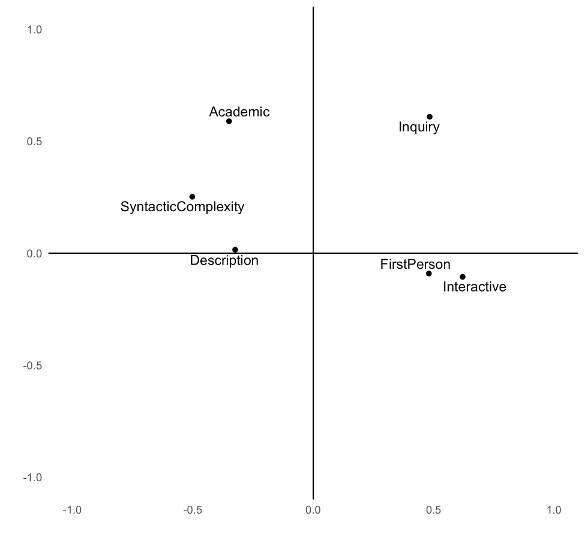
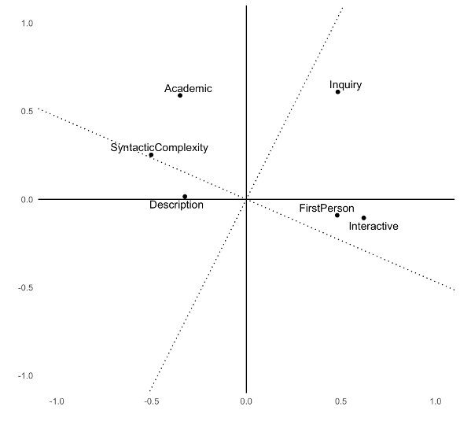
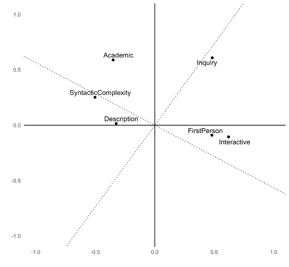

# Linguistic correlation

## Correlation

- Many linguistic variables are related to each other in some way
- That is, if we count their occurrence in texts, the rate of occurrence will be correlated
- If one occurs more often, the other is likely to occur more (or less) often

## Correlation in language

- In English, the relative frequency of adjectives is correlated to the relative frequency of nouns
- Adjectives modify nouns, so they come together

. . .

> *Get Out* is an extraordinary movie, a great catapulting leap forward...

. . .

- This isn't universal---see Hemingway's novels---but it is a strong correlation

## Adjectives vs. nouns in COCA

```{r setup}
library(quanteda.extras) # for sample_corpus
library(udpipe)
library(tidyverse)

theme_set(theme_bw())

ud_model <- udpipe_load_model("../models/english-ewt-ud-2.5-191206.udpipe")
```

```{r tag-sample}
#| cache: true
sample_tagged <- udpipe(sample_corpus, ud_model)
```

```{r}
doc_counts <- sample_tagged |>
  count(doc_id)

pos_counts <- sample_tagged |>
  group_by(doc_id, upos) |>
  summarize(n = n(), .groups = "drop")

noun_adj <- pos_counts |>
  filter(upos %in% c("NOUN", "ADJ")) |>
  pivot_wider(id_cols = doc_id, names_from = upos, values_from = n) |>
  inner_join(doc_counts, by = "doc_id")

ggplot(noun_adj, aes(x = NOUN / n * 1000, y = ADJ / n * 1000)) +
  geom_point() +
  geom_smooth(method = "lm", se = FALSE) +
  labs(x = "Noun frequency (per thousand)", y = "Adjective frequency (per thousand)")
```

## Adjectives vs. verbs in COCA

```{r}
verb_adj <- pos_counts |>
  filter(upos %in% c("VERB", "ADJ")) |>
  pivot_wider(id_cols = doc_id, names_from = upos, values_from = n) |>
  inner_join(doc_counts, by = "doc_id")

ggplot(verb_adj, aes(x = VERB / n * 1000, y = ADJ / n * 1000)) +
  geom_point() +
  geom_smooth(method = "lm", se = FALSE) +
  labs(x = "Verb frequency (per thousand)", y = "Adjective frequency (per thousand)")
```

## Pronouns vs. coordinators in COCA

```{r}
pron_coord <- pos_counts |>
  filter(upos %in% c("PRON", "CCONJ", "SCONJ")) |>
  pivot_wider(id_cols = doc_id, names_from = upos, values_from = n) |>
  inner_join(doc_counts, by = "doc_id")

ggplot(pron_coord, aes(x = PRON / n * 1000, y = (CCONJ + SCONJ) / n * 1000)) +
  geom_point() +
  geom_smooth(method = "lm", se = FALSE) +
  labs(x = "Pronoun frequency (per thousand)", y = "Coordinator frequency (per thousand)")
```

# Correlation measures

## Pearson correlation

- Pearson correlation is the correlation coefficient you probably know best
- The correlation $\rho$ is in $[0, 1]$; 0 means no linear correlation, 1 means perfect linear correlation

$$
\rho(X, Y) = \frac{\operatorname{cov}(X, Y)}{\sigma_X \sigma_Y} = \frac{\sum_{i=1}^n (x_i - \bar x) (y_i - \bar y)}{\sqrt{\sum_{i=1}^n (x_i - \bar x)^2} \sqrt{\sum_{i=1}^n (y_i - \bar y)^2}}
$$

For example,

```{r}
#| echo: true
cor(noun_adj$NOUN, noun_adj$ADJ, use = "complete.obs")
```

## Spearman correlation

- Linear (Pearson) correlation only measures linear relationships; a strong but curved relationship has correlation $|\rho| < 1$
- Spearman correlation uses the *ranks*, so it measures *any* monotone relationship

```{r}
library(gt)

noun_adj |>
  mutate(ADJ = ADJ / n * 1000,
         NOUN = NOUN / n * 1000) |>
  arrange(ADJ, NOUN) |>
  mutate(adj_rank = rank(ADJ),
         noun_rank = rank(NOUN)) |>
  select(doc_id, ADJ, adj_rank, NOUN, noun_rank) |>
  head(n = 10) |>
  gt() |>
  cols_label(doc_id = "Document", ADJ = "Adjectives", adj_rank = "Adj. rank", 
             NOUN = "Nouns", noun_rank = "Noun rank") |>
  fmt_number(c(ADJ, NOUN), decimals = 1)
```

## Correlation examples

```{r}
# example from https://commons.wikimedia.org/wiki/File:Spearman_fig1.svg
x <- runif(50, 0, 1)
y <- log(x / (1 - x))
y <- sign(y) * abs(y)^1.4

data.frame(x = x, y = y) |>
  ggplot(aes(x = x, y = y)) +
  geom_point()
```

```{r}
#| echo: true
cor(x, y)
cor(x, y, method = "spearman")
```

## Cut-offs

Rough cut-off values are used to indicate the size of correlation (Cohen 1988: 79-80); this is a measure of effect size:

- 0 no effect
- ± 0.1 small effect
- ± 0.3 moderate effect
- ± 0.5 strong effect

## Correlation matrices

Every pairwise correlation between a set of variables can be presented in a matrix:

:::: {.columns}

::: {.column width = "50%"}

#### Pearson correlation

```{r}
counts <- pos_counts |>
  filter(upos %in% c("NOUN", "VERB", "ADJ", "PRON", "ADV")) |>
  pivot_wider(id_cols = doc_id, names_from = upos, values_from = n) |>
  inner_join(doc_counts, by = "doc_id") |>
  mutate(across(!c(doc_id, n), ~ .x / n * 1000)) |>
  select(ADJ, ADV, NOUN, PRON, VERB)

cor(counts, use = "complete.obs") |>
  as.data.frame() |>
  rownames_to_column("pos") |>
  gt() |>
  fmt_number(!pos) |>
  cols_label(pos = "")
```
:::

::: {.column width="50%"}

#### Spearman correlation

```{r}
cor(counts, method = "spearman", use = "complete.obs") |>
  as.data.frame() |>
  rownames_to_column("pos") |>
  gt() |>
  fmt_number(!pos) |>
  cols_label(pos = "")
```

:::

::::

The matrix

- has 1 on the diagonal
- is symmetric
- can be turned into a cool heatmap

## Correlation plots

:::: {.columns}

::: {.column width = "50%"}

```{r}
library(corrplot)
corrplot(cor(counts, use = "complete.obs"), type = "upper",
         tl.col = "black", tl.srt = 45, diag = F, tl.cex = 0.5)
```

:::

::: {.column width = "50%"}

```{r}
corrplot(cor(counts, method = "spearman", use = "complete.obs"), type = "upper",
         tl.col = "black", tl.srt = 45, diag = F, tl.cex = 0.5)
```

:::

::::

## Pair plots

```{r}
#| echo: true
pairs(counts)
```

## Coefficient of determination

- Pearson’s correlation coefficient r can be used to account for the amount of variance in one variable "explained" by the other variable
- For this, calulate its square: $R^2$

## Reporting your results

> There is a strong positive correlation ($r = .55$, 95% CI [.48, .61]) between the number of nouns and the number of adjectives used in American English. This value, however, is not as large as the correlation between verbs and pronouns ($r = .75$, 95% CI [.71, .78]), each of which explains more than half the variance of the other ($R^2 = 56$%).

. . .

> There is a strong negative correlation ($r_s = -.84$, $p < .01$) between the number of nouns and the number of pronouns used in American English. These show a complementary distribution.

## Reporting your results

> American English verbs and adjectives are in an inverse proportional relationship ($r = -.61$\*\*), as are verbs and nouns ($r = -.67$\*\*). The negative correlation between verbs and coordinators is near zero, however ($r = -.04$), indicating those lexical classes have no observable relationship.

(Stargazing!)

# Factor analysis

## Basic motivation

- Let $X$ be an $n \times p$ matrix of observed data, such as rates of $p$ parts of speech in $n$ documents
- If columns 1, 2, and 4 are strongly correlated with each other, and 3, 5, and 6 are also strongly correlated with each other, but there's little correlation between the groups, then:
  - Maybe 1, 2, and 4 measure one underlying "factor"
  - Maybe 3, 5, and 6 measure a different factor
  - These two factors might "explain" most of the variation in $X$
- How do we automatically find the factors?

## More mathematically

- Let $X$ be an $n \times p$ matrix of observed data, such as rates of $p$ parts of speech in $n$ documents
- Suppose there are $m$ common factors, where $m < p$
- Suppose each document $i$ can be expressed with its common factors, plus some noise

. . .

What should this remind you of?

## The factor model

The factor model is that
$$
\underbrace{X}_{n \times p} = \underbrace{F}_{n \times m} \underbrace{L}_{m \times p} + \underbrace{\epsilon}_{n \times p}
$$
where $X$ has been centered so its columns have mean 0.

- $F$: each document's factor coordinates
- $L$: loading of each factor on original variables
- $\epsilon$: mean 0, diagonal variance noise
- $F$ and $\epsilon$ are independent

## Examples

$$
X = FL + \epsilon
$$

- $n$ students solve $p$ calculus test questions
  - Most variation in scores can be explained by $m = 1$ factor: how good you are at calculus
- $n$ people take $p$ personality test questions
  - Most personality features can be explained in terms of $m = 5$ factors (the Big Five personality traits)
- $n$ documents have $p$ different linguistic features measured
  - The features represent $m$ underlying factors, like formality, information density, etc.

## Fitting a factor analysis

- Factor analysis should remind you of PCA
  - But PCA doesn't have $\epsilon$, so factor analysis does *not* explain independent noise, only variance that is *shared*
- We can find $F$ and $L$ by starting with PCA
- Alternately, assume $\epsilon$ and $F$ are both multivariate normal
  - Then do maximum likelihood estimation
- Unlike PCA, we do *not* require factors to be orthogonal
- Any rotation of the factors is equivalent, so we choose based on interpretability

# Multidimensional Analysis (MDA)

## Biber's MDA

- Multidimensional analysis (MDA) was developed by @Biber:1985
- Goal is to use factor analysis to systematically identify principles of language variation [@Biber:1988]

## Stages of MDA

1. Identify of relevant variables
2. Extract factors from variables
3. Interpret factors as functional dimensions
4. Place document categories on the dimensions

## Step 1: Identify relevant variables

Biber defined 67 linguistic features, like

:::: {.columns}

::: {.column width="50%"}

- past tense verbs
- present tense verbs
- first-person pronouns
- second-person pronouns
- *that* relative clauses
- present participles

:::

::: {.column width="50%"}

- pied piping
- mean word length
- downtoners
- predictive models
- possibility modals
- contractions

:::

::::

These features distinguish different types of written and spoken English.

## Step 2: Extract factors from variables

- From the many relevant variables, extract a few factors
- We can just use factor analysis:
  $$
  X = FL + \epsilon
  $$
  - $X$: matrix of features for each document, centered & scaled
  - $F$: each document's factor coordinates
  - $L$: loading of each factor on original features

. . .

- To ensure there are only a few factors and each is interpretable,
  - Only include variables that are correlated with at least some other variables (e.g., $|\rho| \geq 0.2$)
  - For factors, only keep loadings that are a minimum size
  
## Step 2: Loading the corpus

```{r}
#| echo: true
#| message: false
library(cmu.textstat)
library(tidyverse)
library(quanteda)
library(nFactors)
library(mda.biber)

brown_biber <- brown_biber |>
  left_join(dplyr::select(brown_meta, doc_id, text_type)) |>
  mutate(text_type = as.factor(text_type)) |>
  column_to_rownames("doc_id") |>
  relocate(text_type)
```

## Step 2: Variables are highly correlated

```{r biber-corr}
#| fig-width: 9
#| fig-height: 9
bc_cor <- brown_biber |>
  select(!text_type) |>
  cor(method = "pearson")

corrplot::corrplot(bc_cor, type = "upper", order = "hclust",
         tl.col = "black", tl.srt = 45, diag = FALSE, tl.cex = 0.5)
```

## Step 2: Determine the number of factors

```{r}
#| echo: true

screeplot_mda(brown_biber)
```

## Step 2: Rotate the factors

- If we have $m$ factors, they span an $m$-dimensional space
- Any other basis for that space can yield an identical fit!
- So choose the factors that help us interpret each factor as a distinct thing

. . .

For example, suppose we have $p = 6$ variables and choose $m = 2$

## Step 2: Rotate the factors



## Step 2: Varimax rotation



## Step 2: Promax rotation



## Step 3: Interpret the rotated factors

```{r}
bc_mda <- mda_loadings(brown_biber, n_factors = 3)

attr(bc_mda, 'loadings') |>
  rownames_to_column("Feature") |>
  arrange(desc(abs(Factor1))) |>
  head(n = 10) |>
  gt() |>
  fmt_number(
    columns = everything(),
    decimals = 2
  )
```

## Step 4: Place documents on the factor dimensions

$$
X = FL + \epsilon
$$

1. Threshold the factor loadings $L$ to pick the large loadings
2. For each dimension,
   - Sum up the variables with large positive loadings
   - Subtract those with large negative loadings
3. Calculate for each document and take means per category/corpus/text type

## Step 4: Placement on factor 1

```{r}
heatmap_mda(bc_mda, n_factor = 1)
```

## Step 4: Placement on all factors

```{r}
#| echo: true
#| results: hide
library(gtsummary)

f1 <- lm(Factor1 ~ group, data = bc_mda)
f2 <- lm(Factor2 ~ group, data = bc_mda)
f3 <- lm(Factor3 ~ group, data = bc_mda)

tbl_merge(list(
  tbl_regression(f1, intercept = TRUE),
  tbl_regression(f2, intercept = TRUE),
  tbl_regression(f3, intercept = TRUE)
  ),
  tab_spanner = c("Factor 1", "Factor 2", "Factor 3")
)
```

## Step 4: Placement on all factors

```{r}
f1 <- lm(Factor1 ~ group, data = bc_mda)
f2 <- lm(Factor2 ~ group, data = bc_mda)
f3 <- lm(Factor3 ~ group, data = bc_mda)

tbl_merge(list(
  tbl_regression(f1, intercept = TRUE),
  tbl_regression(f2, intercept = TRUE),
  tbl_regression(f3, intercept = TRUE)
  ),
  tab_spanner = c("Factor 1", "Factor 2", "Factor 3")
)
```

# Common linguistic variables

## Biber features

- Developed by @Biber:1988 for studying different registers of English 
- 67 features, mostly counts/rates, based on pattern-matching features in text
- Good for distinguishing formal/informal texts, informational vs. interactive, etc.
- Can be automatically tagged with pseudobibeR: <https://cran.r-project.org/package=pseudobibeR>

## DocuScope

- Developed at CMU over 25 years
- Based on a dictionary of millions of phrases grouped into rhetorical categories
- Examples:
  - Description
  - Academic
  - Information
  - Interactivity
  - Positive
  - Negative
- Can be automatically tagged with a spaCy model trained on the dictionary: <https://docuscospacy.readthedocs.io/en/latest/docuscope.html>

## Works cited
