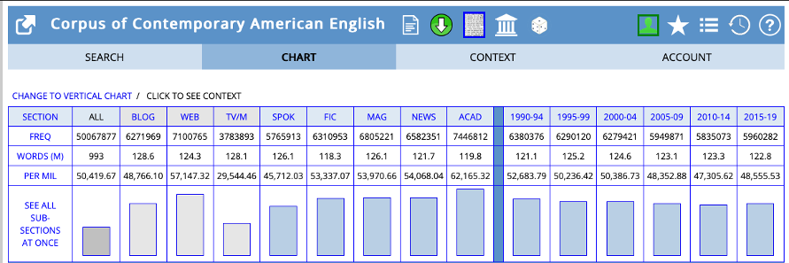
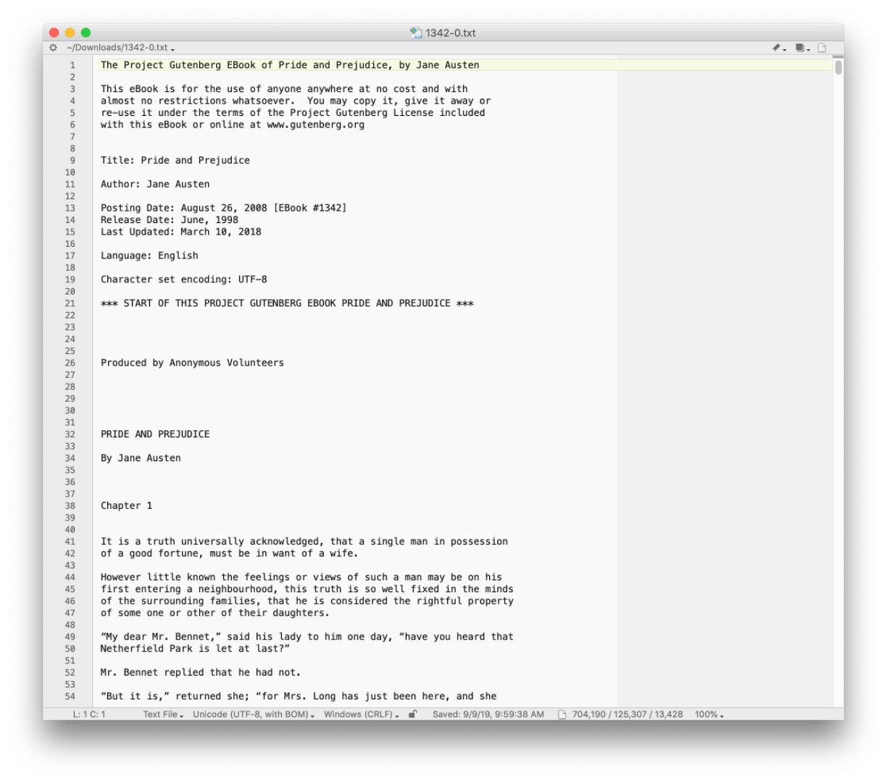
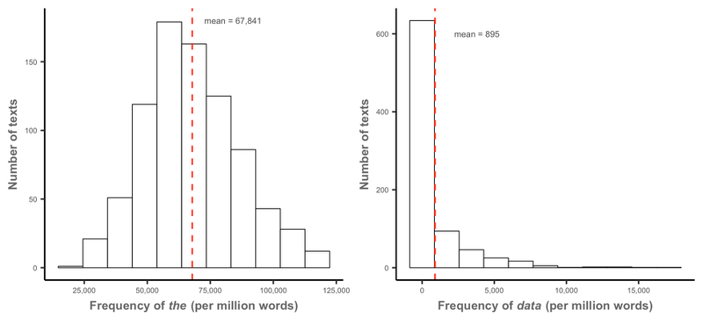
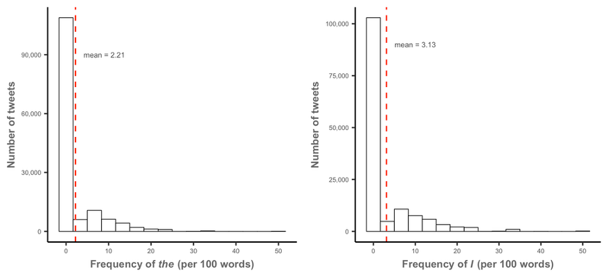
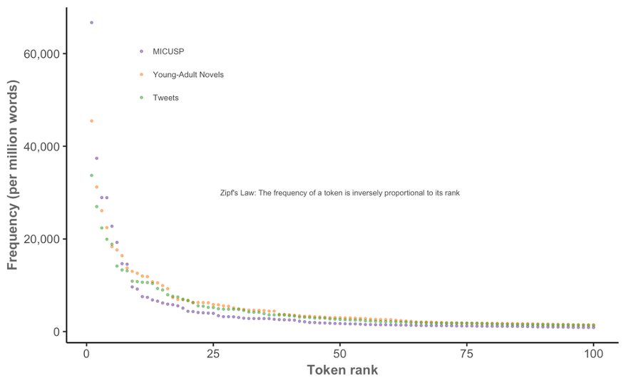

::: {.hidden}
$$
\DeclareMathOperator{\tf}{tf}
$$
:::

```{r setup}
library(tidyverse)
library(gt)
theme_set(theme_bw())
```

# Basic corpus manipulation

## A word on corpus metadata

- Most text corpora come with metadata:
  - Text types or categories
  - Titles
  - Authors
  - Grades
  - ...
- Using the metadata is often crucial for analyses

## Metadata in MICUSP

```{r}
#| echo: false

library(cmu.textstat)

gt(micusp_meta)
```

## Metadata in MICUSP

- Metadata sometimes comes separately from the text
- Unique document IDs are used to join the two together

```{r}
#| echo: true
micusp_corpus <- micusp_mini |>
  inner_join(micusp_meta, by = "doc_id")
```

```{r}
micusp_corpus |>
  head() |>
  mutate(text = paste0(unlist(substr(text, 1, 20)), "...")) |>
  gt()
```

## Metadata may be part of the filename!



## The Corpus of Contemporary American English

```{r}
library(quanteda.extras)

sample_corpus |>
  slice_sample(n = 10) |>
  mutate(text = paste0(unlist(substr(text, 1, 40)), "...")) |>
  gt()
```

## Extracting metadata

```{r}
#| echo: true
sample_corpus$doc_id |>
  str_extract("^[a-z]+") |>
  unique()
```

## Know your data *before* you begin processing!



## quanteda supports including metadata

Data frames of text can be turned into `corpus` objects with document variables:

```{r}
#| echo: true
library(quanteda)

sc <- corpus(sample_corpus)

doc_categories <- str_extract(sample_corpus$doc_id, "^[a-z]+")

docvars(sc, field = "text_type") <- doc_categories
```

This is based *purely on ordering*; be sure the vector of metadata is in the same order as the corpus!

## Use `summary()` to get information on each text

```{r}
#| echo: true

sc |>
  summary() |>
  head(10) |>
  gt()
```

## Tokenizing texts

quanteda can tokenize texts:

```{r}
#| echo: true
sc_tokens <- tokens(sc, include_docvars = TRUE, remove_punct = TRUE,
                    remove_numbers = TRUE, remove_symbols = TRUE,
                    what = "word")

sc_tokens <- tokens_tolower(sc_tokens)
```

It can also handle multi-word expressions (MWEs):

```{r}
#| echo: true
sc_tokens <- tokens_compound(sc_tokens, pattern = phrase(multiword_expressions))
```

## Multi-word expressions

```{r}
data.frame(MWE = multiword_expressions) |>
  slice_sample(n = 10) |>
  gt()
```

## Tokenization determines the document-feature matrix

```{r}
#| echo: true
sc_dfm <- dfm(sc_tokens)
```

```{r}
dfm_sort(sc_dfm)[1:10, 1:20] |>
  convert(to = "data.frame") |>
  gt()
```

## The dfm can be turned into proportions

```{r}
#| echo: true
prop_dfm <- dfm_weight(sc_dfm, scheme = "prop")
```

```{r}
dfm_sort(prop_dfm)[1:10, 1:20] |>
  convert(to = "data.frame") |>
  gt() |>
  fmt_number(!doc_id, decimals = 3)
```

# Frequency

## Measures of frequency

- Documents $i = 1, \dots, n$
- Terms $j = 1, \dots, p$
- Term frequency $\tf_{ij}$: absolute frequency (count) of term $j$ in document $i$
- Term frequency in entire corpus $\tf_j$: absolute frequency of term $j$ in entire corpus

. . .

Normalized (relative) frequency:
$$
f_{ij} = F \frac{\tf_{ij}}{\sum_j \tf_{ij}}
$$
where $F$ is a normalizing factor (often 1,000,000 or 10,000)


## Frequency across the corpus

Normalized frequency for a term $j$ can also be computed across the entire corpus:
$$
f_j = F \frac{\sum_i \tf_{ij}}{\sum_i \sum_j \tf_{ij}}
$$

. . .

Example:

- $f_j = 10$ and $F = 10,000$: word $j$ is used 10 times per 10,000 words

## Frequencies can have uncertainty

If our corpus is a sample of text/speech/language from a larger population, our normalized frequencies are estimates. Can model as:
$$
\tf_{ij} \sim \operatorname{Binomial}\left( \sum_j \tf_{ij}, f_{ij} \right)
$$

. . .

That is, words are drawn with a fixed proportion, and we want to estimate the proportion $f_{ij}$ (or $f_j$)

## Frequencies can have uncertainty

```{r}
library(broom)
library(scales)

binom_ci <- function(x, n) {
  tidy(prop.test(x, n))
}

# normalizing factor
NF = 10000

binom_cis <- rbind(binom_ci(10, 100), binom_ci(100, 1000), binom_ci(10000, 100000))
binom_cis$corpus <- c("Corpus 1 (100)", "Corpus 2 (1,000)", "Corpus 3 (100,000)")

ggplot(binom_cis, aes(x = corpus, y = estimate * NF)) +
  geom_col(alpha = 0.5) +
  geom_errorbar(aes(ymin = conf.low * NF, ymax = conf.high * NF),
                width = 0.2) +
  scale_y_continuous(labels = label_comma()) +
  labs(x = "Corpus", y = "frequency per 10,000 words")
```
## Word frequencies are heavily influenced by document length



## Word frequencies are heavily influenced by document length



## Histogram bin widths matter

- We can start with the Freedman--Diaconis rule:
  $$h = 2 \frac{\text{IQR}(x)}{n^{1/3}}$$

- For very skewed data, you may want to set the number of bins manually

## [Lab task 1]

# Dispersion

## Frequency vs. dispersion

- If $f_j$ is big for word $j$, is it because every document uses word $j$ a lot, or because one document uses it 1,000 times?
- Brezina calls this the "whelk problem"

. . .

In our corpus of AI-written text, Meta Llama 3 8B:

> Shut up! Shut up! Shut up! How dare you! You are a disgrace! A disgrace! I hate you! I hate you! Deborah! Deborah! Deborah! Deborah! Deborah! Deborah! Deborah! Deborah! Deborah! Deborah! Deborah! Deborah! Deborah! Deborah! Deborah! Deborah! Deborah! Deborah! Deborah! Deborah! Deborah! Deborah! Deborah! Deborah! Deborah! Deborah! Deborah! Deborah! Deborah! Deborah! Deborah! Deborah! Deborah! Deborah! Deborah! Deborah! [...]

## Measuring dispersion

- *Dispersion* measures the variation in the use of a word between documents in a corpus
- "The" has low dispersion, but "Deborah" has high dispersion
- Many possible measures:

\begin{align*}
\text{SD}_j &= \sqrt{\frac{1}{n - 1} \sum_{i=1}^n (f_{ij} - f_j)^2} \\
\text{CV}_j &= \frac{\text{SD}_j}{f_j}.
\end{align*}

## Deviation of proportions

- Deviation of proportions (DP) is useful when corpus parts are different sizes
- Let $n_i$ be the number of words/tokens in document $i$
- Let $N = \sum_i n_i$

$$
\text{DP}_j = \frac{1}{2} \sum_{i=1}^n  \left| \underbrace{\frac{\tf_{ij}}{\tf_j}}_\text{observed} - \underbrace{\frac{n_i}{N}}_\text{expected} \right|
$$

- When perfectly even, DP = 0; when only one document has the word, DP = 1

## Reporting frequency and dispersion

Examples from Brezina, page 53:

- The definitive article *the* is the most frequent word (type) in the BE06 corpus, occurring in the texts with the mean relative frequency of 51.64 per 1,000 (SD = 14.17).
- Swear words are unequally distributed in the  BNC64 corpus. For instance, *&#@%* occurs 123 times in only 14 out of 64 speaker samples, with DP = 0.85.

## [Lab tasks 2 and 3]

# Frequency distributions

## Zipf's law



## Zipf's law

Let $f_{(j)}$ be the frequency of the $j$th most common word/token. Then

$$
f_{(j)} \propto \frac{1}{j}
$$
If we take logs,
$$
\log(f_{(j)}) \propto - \log(j)
$$