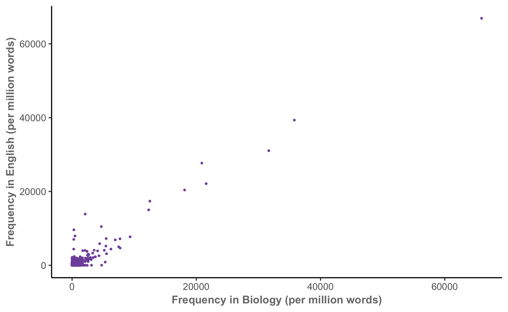
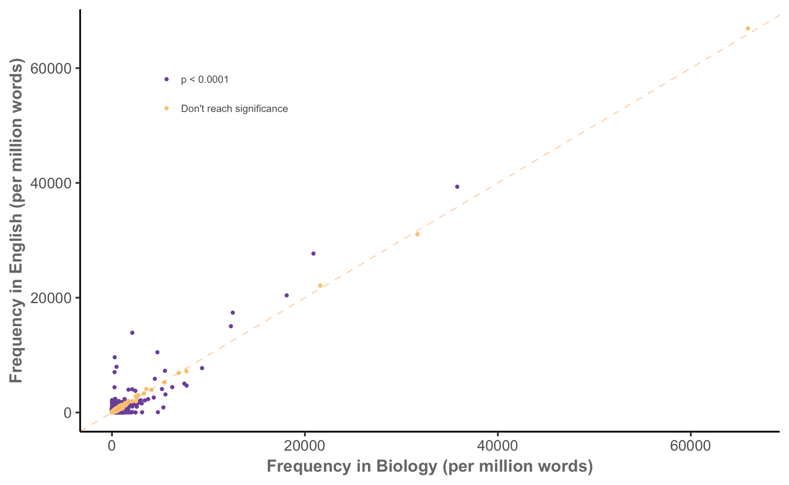
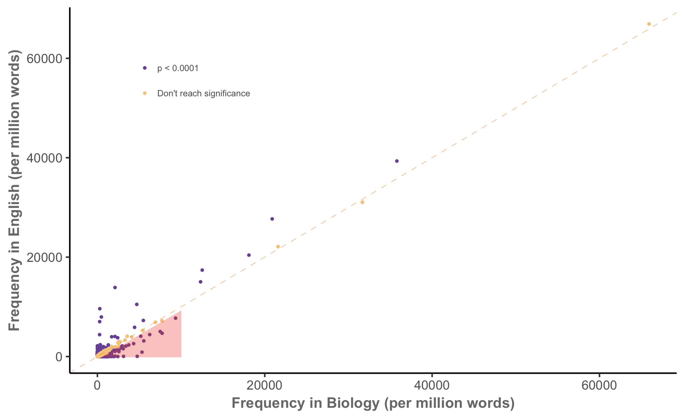
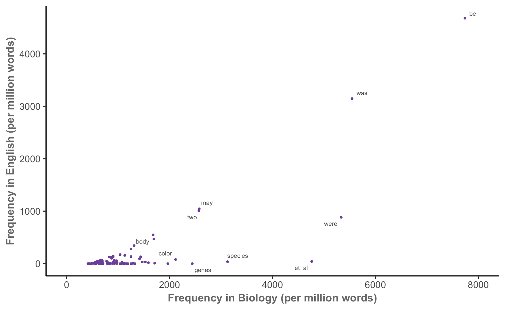
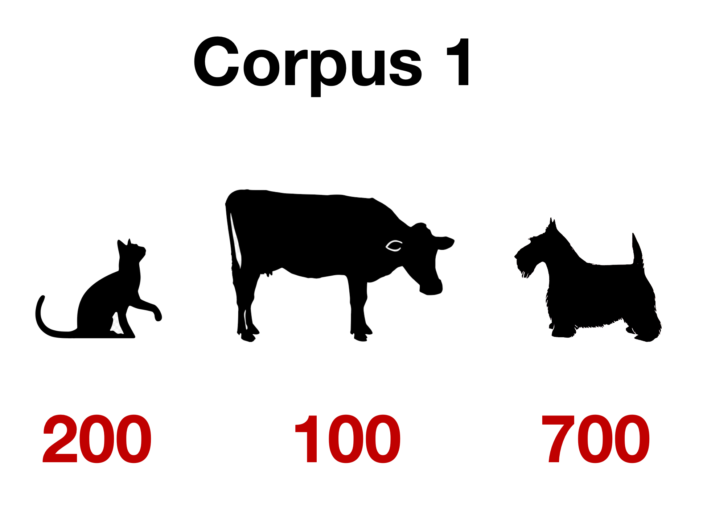
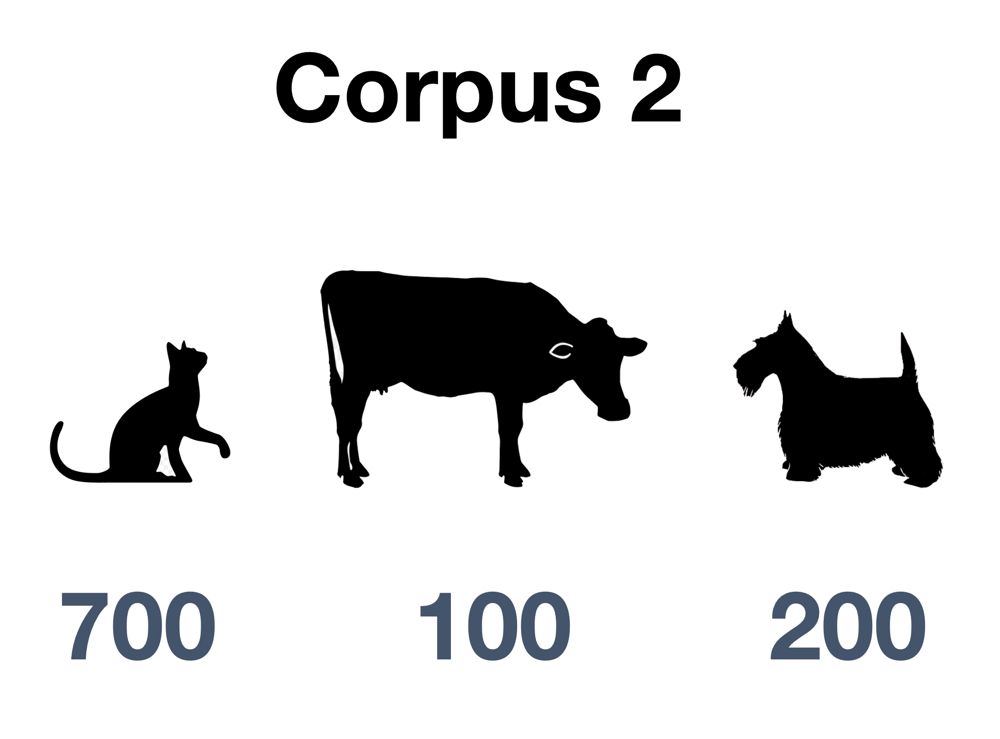
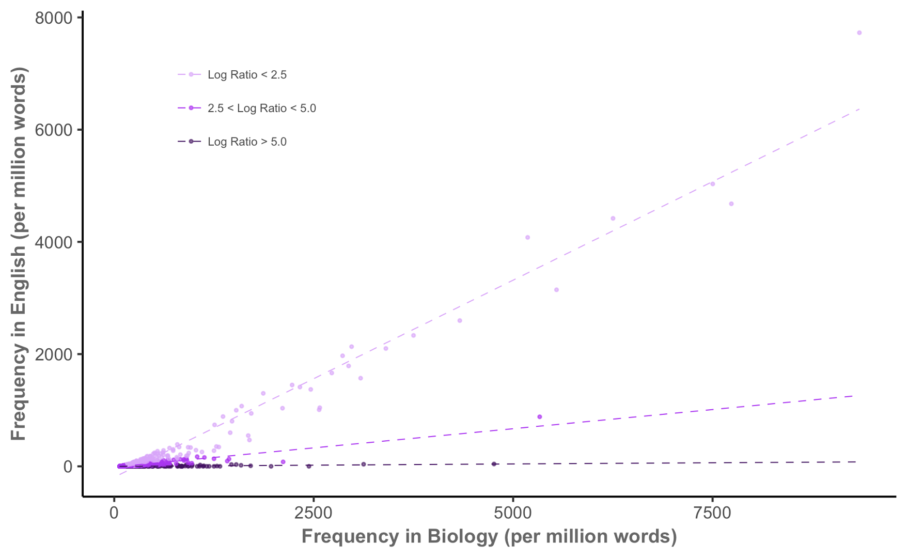

## Keyness

- A *keyword* is a word that is "considerably" more frequent in one corpus than
  in another
- *Keyness* is a measure of just how key a word is

Problems:

- What does "considerably" mean?
- How do we measure and compare frequency?

## Keyness in biology



## Keyness in biology


## Keyness in biology



## Keyness in biology



## Keyness in biology



## How do we compare keyness between corpora?

Treat this as a binomial proportion comparison task:

| | Word | Other words | Total
|-----|-----|-----|-----|
| **Corpus 1** | $O_{11}$ | $O_{12}$ | $C_1 = O_{11} + O_{12}$ |
| **Corpus 2** | $O_{21}$ | $O_{22}$ | $C_2 = O_{21} + O_{22}$ |
| **Total** | $R_1 = O_{11} + O_{21}$ | $R_2 = O_{12} + O_{22}$ | $N = C_1 + C_2$|

. . .

Expected counts if use is independent:

$$
E_{ij} = \frac{C_i R_j}{N}
$$

## Our two corpora

:::: {.columns}

::: {.column width="50%"}

#### Corpus 1

cat dog dog cow cat dog dog dog dog dog cat dog dog cat dog dog dog dog dog dog dog dog cat dog dog dog dog dog dog dog dog dog cow dog dog dog dog dog cow dog dog cat cat cat dog cat cat dog dog dog dog dog cat dog dog dog dog cow dog dog cow cow cat cat dog dog dog dog cat cat cat dog dog dog dog cat dog dog cat dog dog dog dog dog cat cat dog dog dog dog dog dog cow cow dog cat dog cat cat cow cow dog dog dog dog dog dog dog dog dog cat dog dog dog cat cow cow dog cow cat dog dog cat cow dog dog dog dog dog cat cat cow cow dog dog cow dog dog cat dog cat dog dog dog 
...

:::

::: {.column width="50%"}

#### Corpus 2

dog cat cat cow cat cat cat dog cow cat cat cat cat cat cat cat dog dog cow cat cat cat cat cat cat cat cow cat cat dog cat cat cat cat cat cat cow cat cat cat dog cat cat cat cat dog cat dog dog cat dog cat cat cat cat cow dog cat cat cat cat dog dog cat cat cat cat cow dog dog cat cat cat cat cat cat dog cat cat dog cat cat dog cat cat cat dog cat cat cat dog cat cat cat dog cat cat cat dog cow cat cat cat dog dog cat cat cat dog dog cat cat cat cat cat dog dog cat cow cat dog cat cat cat cat cow cat cat cat dog dog cat cat cat cow cat cat cat cow cat cat cat cat cat
...
:::

::::

## Our two corpora, summarized

:::: {.columns}

::: {.column width="50%"}



:::

::: {.column width="50%"}



:::

::::

## Observed frequencies for *dog*

| | Word | Other words | Total
|-----|-----|-----|-----|
| **Corpus 1** | 700 | 300 | 1000 |
| **Corpus 2** | 200 | 800 | 1000 |
| **Total** | 900 | 1100 | 2000 |

## Expected frequencies for *dog*

| | Word | Other words | Total
|-----|-----|-----|-----|
| **Corpus 1** | *450* | 550 | 1000 |
| **Corpus 2** | 450 | 550 | 1000 |
| **Total** | 900 | 1100 | 2000 |

$$
E_{11} = \frac{C_1 R_1}{N} = \frac{1000 \times 900}{2000} = 450.
$$

# Testing keyness

## What tests can we use?

- $\chi^2$ test of independence
  - Tests $H_0$ that word choice is independent of corpus
  - The statistic is *asymptotically* $\chi^2$ as $N \to \infty$
  - Approximation is poor when some cells have small values
  - ...so works poorly for uncommon words
- Likelihood ratio test
  - Again, model word use as binomial:
    \begin{align*}
    O_{11} &\sim \text{Binomial}(C_1, p_1) \\
    O_{21} &\sim \text{Binomial}(C_2, p_2)
    \end{align*}

## Computing the likelihood ratio

Under $H_0$, $p_1 = p_2$. The expected proportion is
$$
p_1 = \frac{E_{11}}{C_1} = \frac{E_{21}}{C_2} = p_2.
$$

. . .

The likelihood ratio test statistic is
\begin{align*}
\lambda ={}& \log\left( \frac{L(O \mid H_0)}{L(O \mid H_A)} \right)\\
={}& O_{11} \log \frac{E_{11}}{O_{11}} + O_{21} \log \frac{E_{21}}{O_{21}}\\
&{}+ O_{12} \log \frac{E_{12}}{O_{12}} + O_{22} \log \frac{E_{22}}{O_{22}}.
\end{align*}

## Conducting the likelihood ratio test

- For maximum likelihood estimators, $-2 \lambda$ converges to $\chi^2$ as $N \to \infty$
- This is a better approximation than for the usual $\chi^2$ test
- $\lambda$ can be used as measure of keyness difference
- Often only the first two terms are used, as latter two are symmetric: $O_{12} = C_1 - O_{11}$, and so on

## Farmyard likelihood ratio test

:::: {.columns}

::: {.column width="50%"}
#### Observed

| | Word | Other words | Total
|-----|-----|-----|-----|
| **Corpus 1** | 700 | 300 | 1000 |
| **Corpus 2** | 200 | 800 | 1000 |
| **Total** | 900 | 1100 | 2000 |

:::

::: {.column width="50%"}

#### Expected

| | Word | Other words | Total
|-----|-----|-----|-----|
| **Corpus 1** | 450 | 550 | 1000 |
| **Corpus 2** | 450 | 550 | 1000 |
| **Total** | 900 | 1100 | 2000 |

:::

::::

\begin{align*}
\lambda &= 700 \log \frac{450}{700} + 200 \log \frac{450}{200} + \\
&\qquad 300 \log \frac{550}{300} + 800 \log \frac{550}{800}
\end{align*}

. . .

```{r}
observed <- matrix(c(700, 300, 200, 800), nrow = 2, byrow = TRUE)
expected <- matrix(c(450, 550, 450, 550), nrow = 2, byrow = TRUE)

loglik = -2 * sum(observed * log(expected / observed))
```

. . .

$$
-2 \lambda = `r signif(loglik)`
$$

## Farmyard likelihood ratio test

Since $-2 \lambda \to \chi^2(1)$ as $n \to \infty$, the $p$-value is given by $\chi^2(1)$:

```{r}
#| echo: true
pchisq(loglik, df = 1, lower.tail = FALSE)
```

This is also known as a *G*-test, and the statistic is sometimes called $G^2$

## In practice (`keyness.qmd`)

```{r process-corpus}
library(tidyverse)
library(quanteda)
library(quanteda.textstats)
library(quanteda.extras)
library(gt)

sc <- sample_corpus |>
  mutate(text = preprocess_text(text)) |>
  corpus()

doc_categories <- sample_corpus |>
  dplyr::select(doc_id) |>
  mutate(doc_id = str_extract(doc_id, "^[a-z]+")) |>
  rename(text_type = doc_id)

docvars(sc) <- doc_categories

sc_dfm <- sc |>
  tokens(what = "fastestword", remove_numbers = TRUE) |>
  tokens_compound(pattern = phrase(multiword_expressions)) |>
  dfm()
```

```{r keyness-1}
#| echo: true
acad_kw <- textstat_keyness(sc_dfm, docvars(sc_dfm, "text_type") == "acad", 
                            measure = "lr")

```

## In practice (`keyness.qmd`)

```{r keyness-2}
#| echo: true

sub_dfm <- dfm_subset(sc_dfm, text_type == "acad" | text_type == "fic")
sub_dfm <- dfm_trim(sub_dfm, min_termfreq = 1)
textstat_keyness(sub_dfm, docvars(sub_dfm, "text_type") == "fic", 
                 measure = "lr") |>
  head(n = 10)
```

# Quantifying keyness

## Measures of keyness effect size

How do we report keyness?

- Rate in corpus 1: $O_{11} / C_1$
- Rate in corpus 2: $O_{21} / C_2$

We could report:

- Difference: $O_{11} / C_1 - O_{21} / C_{2}$
- Ratio: $(O_{11} / C_1) / (O_{21} / C_2)$

Small counts may lead to extreme ratios

## The log-ratio

$$
\text{LR} = \log_2 \left( \frac{O_{11} / C_1}{O_{22} / C_2} \right)
$$

. . .

For example, if the word is $2 \times$ more common in corpus 1 than in corpus 2,

$$
\text{LR} = \log_2(2) = 1.
$$

If it is equally common,
$$
\text{LR} = \log_2(1) = 0.
$$

## Calculating log-ratios

```{r keyness-table}
#| echo: true

acad_dfm <- dfm_subset(sc_dfm, text_type == "acad") |> 
  dfm_trim(min_termfreq = 1)
fic_dfm <- dfm_subset(sc_dfm, text_type == "fic") |> 
  dfm_trim(min_termfreq = 1)

acad_kw <- keyness_table(acad_dfm, fic_dfm)
```

```{r}
head(acad_kw, n = 10) |>
  gt() |>
  fmt_number(c(!Token, !PV), n_sigfig = 3) |>
  fmt_scientific(PV, n_sigfig = 3)
```

# Practical details

## Log-likelihood and log-ratios are different

- Log-likelihood tells us how much evidence we have that our observed difference is meaningful.

- Log ratio tells us the magnitude of the difference.

- Just like the difference between $t$ statistic and $p$-value, or $\hat \beta$ and its $p$-value, or...

## Remember to check both frequency and dispersion

- Frequencies tell us how often tokens occur in a corpus.

- Dispersions tell us how tokens are distributed in a corpus.

## Scenario 1

- You have a collection of words, all with $0.25 < \text{DP} < 0.5$.

- The words are fairly dispersed, so keyness will describe the corpus generally, and the dispersion may have little effect on your analysis

## Scenario 2

- You have a constellation of features with high frequencies
- One has $\text{DP} = 0.75$
- You may want to exclude it from keyness analysis, since it's mostly driven by a small portion of texts

## Scenario 3

- You have a constellation of features with high frequencies
- One has $\text{DP} = 0.75$
- You may want to focus on that word, to see why it is so common in certain texts

## Keyness in biology, again


## Keyness in biology, again


## Keyness in biology, again



## Keyness pairs

```{r keyness-pairs}
#| echo: true

news_dfm <- dfm_subset(sc_dfm, text_type == "news") |> 
  dfm_trim(min_termfreq = 1)
kp <- keyness_pairs(news_dfm, acad_dfm, fic_dfm)
```

```{r}
kp |>
  head() |>
  gt() |>
  fmt_number(c(!Token, ends_with("_LL"), ends_with("_LR")), n_sigfig = 3) |>
  fmt_scientific(ends_with("_PV"), n_sigfig = 3)
```

## Key of keys

```{r}
#| echo: true

kk <- key_keys(acad_dfm, fic_dfm)
```

```{r}
kk |>
  head(10) |>
  gt() |>
  fmt_number(c(-token, -key_range),
             decimals = 2) |>
  fmt_percent(key_range, decimals = 0, scale_values = FALSE)
```