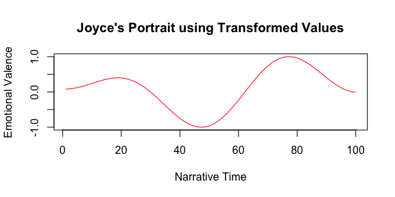
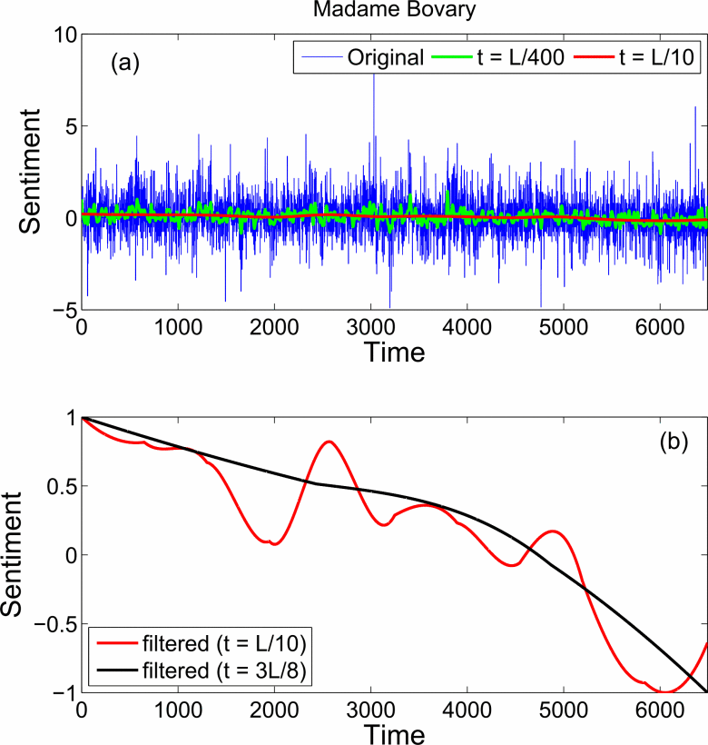
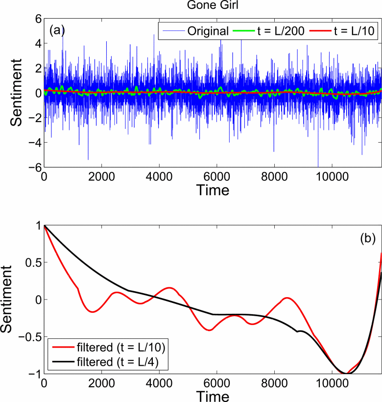

```{r setup}
library(tidyverse)
library(ngramr.plus)
theme_set(theme_bw())
```

## Sentiment analysis

- What is the sentiment of these reviews?
  - "What can I say about the 571B Banana Slicer that hasn't already been said about the wheel, penicillin, or the iPhone.... this is one of the greatest inventions of all time."
  - "By chance, I stumbled upon this glorious and assistive owners guide. It has more than just your average, run of the mill tips and tricks. It provided my wounded heart and weary spirit with a roadmap to facilitating positive change. In it I found a fresh perspective and countless renewed approaches for talking openly with my cat, sans hesitation."

- Can we measure it automatically?
- One approach: categorize all sentiment into positive or negative

## Sentiment dictionaries

One approach is to make a dictionary of words associated with each emotion:

::: {.columns}

::: {.column width="50%"}

**Positive**

- forgive
- ecstatic
- rejoicing
- champion
- resplendent
- ...antiseptic?

:::

::: {.column width="50%"}

**Negative**

- spurious
- nihilism
- frivolous
- outrage
- helpless
- ...carnivorous?

:::

::::

From the [NRC Word-Emotion Association Lexicon](https://saifmohammad.com/WebPages/NRC-Emotion-Lexicon.htm)

## Dictionary-based sentiment taggers

1. Tokenize a document
2. For each token, look it up in your dictionary
3. Count the number in each dictionary category (positive or negative)

This produces a sentiment score.

. . .

But:

- No modifiers: "very bad" is the same as "bad"
- Often little nuance: "forgive" and "resplendent" are both +1
- No sarcasm
- Doesn't understand structure: "I have never felt sad, nihilistic, or outraged" is negative, not positive

## Extending sentiment taggers

There are ways to work around these issues:

- Make dictionaries that include phrases ("very good", "gold star", ...)
- Do part-of-speech tagging and look for specific structures ("*not* good", "*very* bad", ...)
- Try to estimate the positiveness or negativeness of words from data (instead $\pm 1$)
- VADER implements some of these strategies [@Hutto:2014]

. . .

A better approach is to use a language model that understands context, which we'll discuss soon

## Sentiment tagging

The `syuzhet` package implements simple sentiment analysis:

```{r}
#| echo: true
library(syuzhet)

get_sentiment(c("This was a terrible, horrible, no good, very bad day.",
                "I have never felt sad, nihilistic, or outraged.",
                "Everybody loves cute puppies."))
```

## Sentiment trajectories

`syuzhet` can also be used for sentiment *trajectories*, measuring the development of sentiment sentence-by-sentence through a text



Could this measure narrative arcs, distinguishing tragedies from comedies from dramas?

## Narrative arcs

::: {.columns}

::: {.column width="50%"}



:::

::: {.column width="50%"}



:::

::::

(@Gao:2016, figs 1 and 2)

## The controversy

- Jockers says he found "six or seven" unique trajectories that describe thousands of novels
- But there is some controversy over this trajectory idea
- @Swafford:2015 says "the package does not work as advertised"
- We will explore this in the demo

## Works cited
